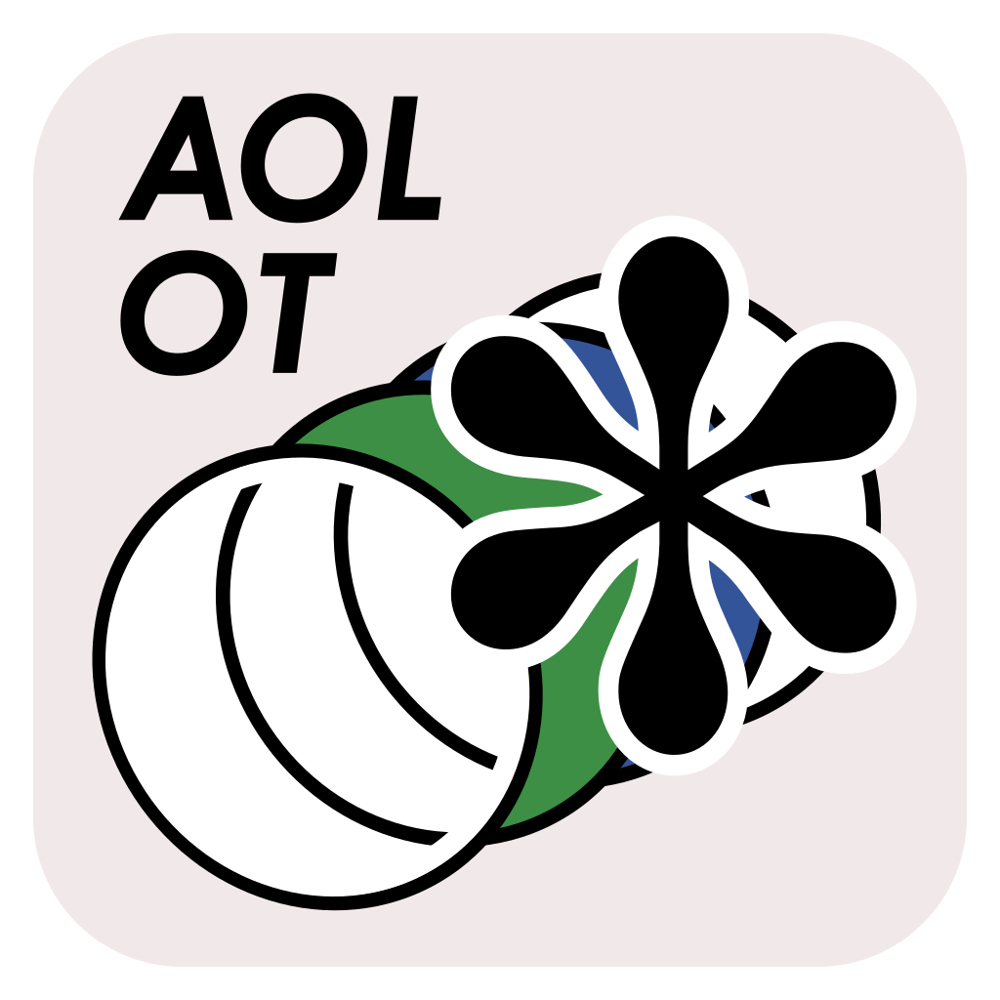

<p align="center">
  
</p>

# AOL Overlay Toolkit

***AOLOT*** (Andrews Osborne Live Overlay Toolkit) is a custom livestream scoreboard app written in Rust with Tauri, which is in active development for the *Andrews Osborne Live* project.

*AOLOT* features:

- fixed window size `640x480`
- user-specified TOML-driven layout configuration with hot-reloading
- global hotkeys that work when the app is out of focus

## Prerequisites

To run the executables provided in the *Release* section similar to a standalone binary, you need to have working installations of [Microsoft Edge WebView2](https://developer.microsoft.com/en-us/microsoft-edge/webview2/?form=MA13LH) and [Microsoft Visual C++ Redistributable](https://learn.microsoft.com/en-us/cpp/windows/latest-supported-vc-redist?view=msvc-170#latest-supported-redistributable-version). If you have a handful of third-party software or games installed, it is very likely that you already meet the prerequisites.

## Configuration

### Global settings

*AOLOT* loads the layout from a TOML file at startup and applies updates when that file changes. Global settings control app-wide styling and are shared by all components.

- `[global].background_color`
- `[global].font.family`
- `[global].font.size`
- `[global].font.color`

### Components

Each component is defined in TOML with a `type` and type-specific fields. Changes are hot-reloaded, so edits to component definitions are reflected while the app is running.

Supported `type` values:

- `number`: optional `keybind.increase`, `keybind.decrease`, `keybind.reset`
- `timer`: `keybind.start`, `keybind.stop`; optional `keybind.increase`, `keybind.decrease`, `keybind.reset`; optional `default = "HH:MM:SS"`
- `label`: optional `edit = true` for runtime text editing
- `image`: `source`, `size.width`, `size.height`; optional `opacity`

If `keybind` is omitted for `number` or `timer`, that component is read-only at runtime.

Timer rounding modes:

- `rounding = "standard"` (default): `MM:SS` or `HH:MM:SS`, zero-padded
- `rounding = "basketball"`: rounded to whole seconds at `>= 1:00` and shown as `M:SS` (seconds zero-padded), then `s.d` below 1 minute with no leading zeros

You can set timer rounding either as `rounding = "basketball"` on the timer component, or with a type table:

```toml
type.kind = "timer"
type.rounding = "basketball"
```

Editable labels (`edit = true`) can be clicked while the app is running to open an input dialog and update label text in memory only (the config file is not modified). While this dialog is open, global scoreboard hotkeys are paused and restored when it closes.

### Keybinding

Keybindings support keyboard shortcuts and Xbox-style gamepad buttons.

Example:

```toml
keybind.increase.key = "Q"
keybind.increase.ctrl = true
keybind.increase.alt = false
keybind.increase.shift = false
keybind.increase.win = false
```

Only `key` is required. Modifier flags default to `false`.

Gamepad examples:

```toml
keybind.start.key = "gamepad:A"
keybind.stop.key = "xbox:START"
keybind.reset.key = "gamepad:DPAD_UP"
```

Supported gamepad button names are:
`A`, `B`, `X`, `Y`, `LB`, `RB`, `LT`, `RT`, `BACK`, `START`, `GUIDE`, `L3`, `R3`, `DPAD_UP`, `DPAD_DOWN`, `DPAD_LEFT`, `DPAD_RIGHT`.

For gamepad bindings, modifier flags (`ctrl`, `alt`, `shift`, `win`) are not allowed.

## Contributing

*AOLOT* is in active development and would benefit from any help that expands upon the currently limited features. We are open to any form of contributions and will do our best to offer any support that might help you do so; if you are interested, feel free to reach out to any contributor listed on this repository.
